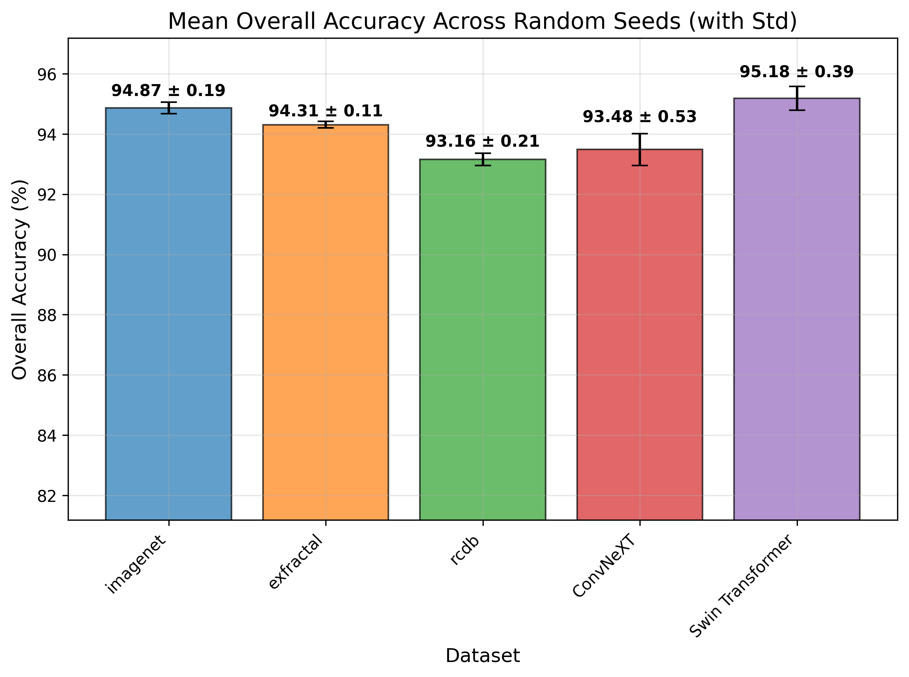
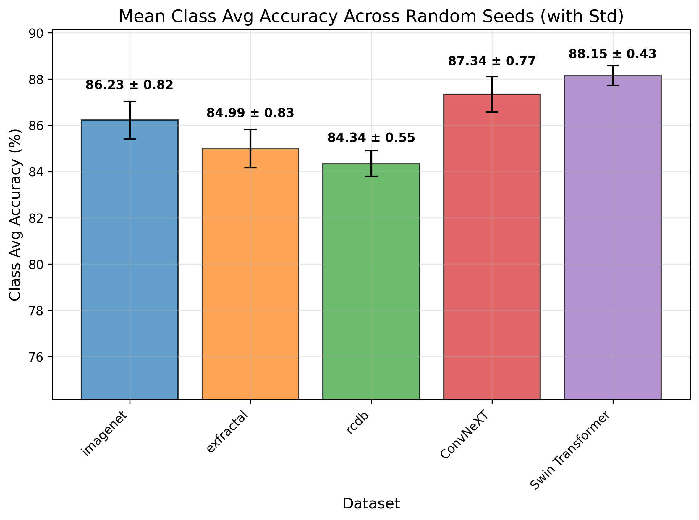

# Microfossil Classification (ISE Group Work)

**Try DEMO on:**
**https://isecvpr2022-pretrained-vit-pytorch.streamlit.app/**

## Reproduction Results

We successfully reproduced the key results from the CVPR 2022 paper on the **SO32 dataset**

## Reproduction Results on SO32 (ViT-Base, 40 epochs)

| Pre-training Dataset              | Top-1 Accuracy | Class-Average Accuracy | Notes                          |
|-----------------------------------|----------------|-------------------------|--------------------------------|
| ExFractalDB-21k                   | 94.31%         | 84.99%                  | close to paper's 85.29%        |
| RCDB-21k                          | 93.16%         | **84.34%**              | different with paper's 86.30%  |
| ImageNet-21k                      | 94.87%         | **86.23%**              | different with paper's 85.61%  |

## Improvment Results on SO32 (Official pre-training weights, 40 epochs)

| Model                             | Top-1 Accuracy | Class-Average Accuracy | Notes                          |
|-----------------------------------|----------------|-------------------------|--------------------------------|
| ConvNeXT                          | 93.48%         | 87.34%                  | increased ~1%                  |
| Swin Transformer                  | 95.18%         | **88.15%**              | increased ~2%                  |

<!-- 
 
 -->

<div style="display: flex; justify-content: flex-start; gap: 30px; margin-bottom: 30px;">
  
  
</div>

Additional visualizations (Grad-CAM, confusion matrices, seed comparisons) are available in the repository.

## Updates

* Add ```inference.py``` code for model inference
* Add ```evaluation.py``` code for results evaluation
* Add plot codes ```draw_gradcam_plot.py```, ```draw_seed_plot.py```, and ```draw_violin_plot.py```
* Implement GradCAM in ```gradcam.py``` for visual explanation and analysis
* Fix environment setting problems in ```py310.yaml``` / ```requirements.txt```
* Implement Canny Edge auxiliary/fusion model. Details in ```scripts/run_finetune_edge.sh```
* ExFractalDB and RCDB Construction details in ```exe_scrips/```
* Downloadable pre-training models [[Link](https://drive.google.com/drive/folders/1ikNUxJoMCx3Lx2TMrXfLdIwI6wwK5w_W?usp=sharing)]
* Original repository [[Link](https://github.com/masora1030/CVPR2022-Pretrained-ViT-PyTorch)]

## Requirements

* Python 3.10
* Pytorch 2.7
* CUDA (worked at 11.8)
* CuDNN (worked at 9.1)
* Graphic board (worked at NVIDIA 4090)
* OpenMPI 1.0 (if using DDP)

Please install packages with the following command. (use conda env)

```bash
$ conda env create -f py310.yml
$ conda activate vit_new
```
> Note: Please do not use ```requirements.txt```, which is for streamlit webapp.

## Pre-training
ExfractalDB abnd RCDB datasets reconstruction files are in ```exe_scripts``` directory.

For pre-training, run job script ```scripts/run_pretrain.sh```.

More details see the original repository.

### Pre-trained models

The original pre-trained models are available in this [[Link](https://drive.google.com/drive/folders/1ikNUxJoMCx3Lx2TMrXfLdIwI6wwK5w_W?usp=sharing)].

## Fine-tuning

For fine-tuning, run job script ```scripts/run_finetune.sh```. 

More details see the original repository.

<!-- - Example : with deit_base, fine-tune ImageNet-1k from pre-trained model (with ExFractalDB-21k), 4 GPUs (Batch Size = 64×4 = 256)

    ```bash
    $ mpirun -npernode 4 -np 4 \
      python finetune.py /PATH/TO/IMAGENET \
        --model deit_base_patch16_224 --experiment finetune_deit_base_ImageNet1k_from_ExFractalDB21000_1.0e-3 \
        --input-size 3 224 224 --num-classes 1000 \
        --sched cosine_iter --epochs 300 --lr 1.0e-3 --weight-decay 0.05 \
        --batch-size 64 --opt adamw \
        --warmup-epochs 5 --cooldown-epochs 0 \
        --smoothing 0.1 --aa rand-m9-mstd0.5-inc1 \
        --repeated-aug --mixup 0.8 --cutmix 1.0 \
        --drop-path 0.1 --reprob 0.25 -j 16 \
        --output ./output/finetune \
        --log-wandb \
        --pretrained-path ./output/pretrain/pretrain_deit_base_ExFractalDB21000_1.0e-3/model_best.pth.tar
    ``` -->

> **Note**
> - cd to your project folder
> - `SOURCE_DATASET`: SO32 Dataset folder - train split
> - `PRETRAIN`: mark which pretrained model to use, and point the path of the pretrained model
> - Training parameters are already set as the same as in the original paper

If you want to try the Canny Edge auxiliary/fusion mode, run job script ```scripts/run_finetune_edge.sh```.

## Inference

For inference, run job script ```scripts/run_inference.sh```.

It will generate a .csv file to store the classification results for all test samples.

> **Note**
> - cd to your project folder
> - `SOURCE_DATASET`: SO32 Dataset folder - val/test split
> - `RESULTS_DIR`: inference results directory
> - If you want to utilize GradCAM to, uncomment the ```--enable-gradcam``` line and set ```--viz-dir```

If you want to inference Canny Edge auxiliary/fusion results, run job script ```scripts/run_inference_edge.sh```.

## Evaluation

For evaluation, run job script ```scripts/run_evaluation.sh```.

It will calculate the accuracy for each class, the overall top-1 accuracy, and the class average accuracy, and generate a confusion matrix plot.

> **Note**
> - cd to your project folder
> - `RESULTS_DIR`: inference result directory
> - `CSV_FILE`: .csv file path (under the inference result directory)

## Result Analysis - Plots

Draw Bar Plot for single/multiple experiments (five seeds test): run ```draw_seed_plot.py```
> - `seed_csv_files` in main(): add the results CSV files path
> - `dataset_groups` in main(): mark the experiment group (e.g. 'rcdb')

Draw Violin Plot for single/multiple experiments: run ```run_seed_plot.py```
> - `--csv_files`: add the results CSV files path
> - `--model_names`: for each result give a name to show in the plot

Draw GradCAM Plot for single experiment: run ```draw_gradcam_plot.py```
> - `VIS_FOLDER`: in make_gradcam_gallery(): change to gradcam visualization directory

---

**Project Info**  

This project is completed as a group work for ISE course.
  
- **Group Members**: Daniil Sobolev, Daniel Zhang, Junyi Liu
- **Repository Maintainer**: Junyi Liu [itsjunyiliu@gmail.com](mailto:itsjunyiliu@gmail.com)
- **Date**: December 23 2025
